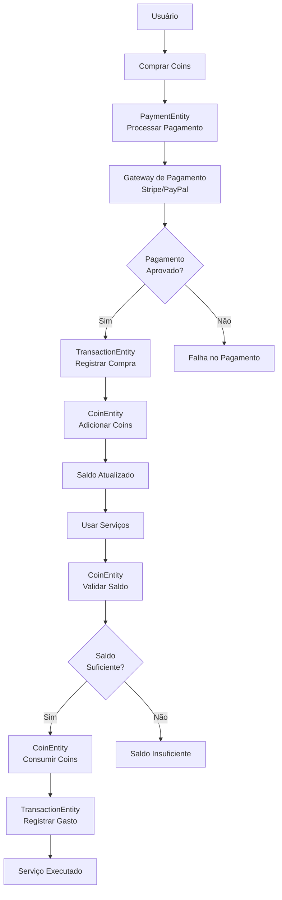
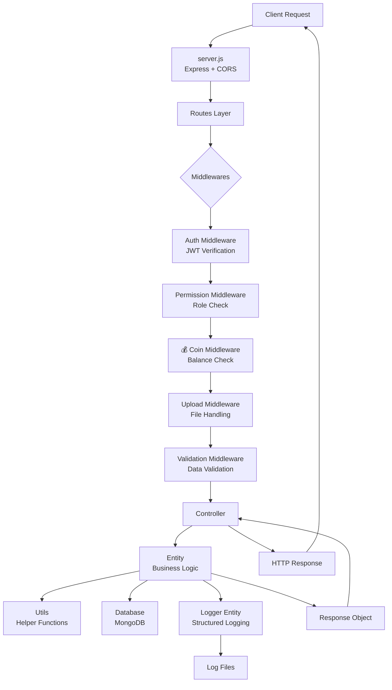

# Mapa Arquitetural do Backend - Plataforma de Tradução

## Contexto da Aplicação
**Plataforma Concorrente da Smartcat**
- Sistema de tradução profissional
- Workspaces colaborativos
- Projetos com arquivos e segmentos
- **SmartCoins**: Sistema de moedas virtuais (equivalente aos SmartWords da Smartcat)

## Estrutura Geral do Projeto

```
backend/
├── config/
│   └── database.js              # Conexão MongoDB
├── controllers/                 # Camada de apresentação
│   ├── UserController.js       # Gerenciamento de usuários
│   ├── WorkspaceController.js  # Controle de workspaces
│   ├── ProjectController.js    # Gestão de projetos
│   ├── FileController.js       # Upload e gestão de arquivos
│   ├── SegmentController.js    # Segmentos de tradução
│   ├── CoinController.js       # 💰 Gestão de SmartCoins (TODO)
│   ├── TransactionController.js# 💳 Histórico de transações (TODO)
│   └── PaymentController.js    # 🏦 Processamento de pagamentos (TODO)
├── core/                        # Núcleo da aplicação
│   ├── access/
│   │   ├── roles.js            # Definições de permissões
│   │   └── permissions.js      # Estrutura de acessos
│   ├── entities/               # Lógica de negócio
│   │   ├── UserEntity.js       # Gerenciamento de usuários
│   │   ├── WorkspaceEntity.js  # Workspaces/organizações
│   │   ├── ProjectEntity.js    # Projetos de tradução
│   │   ├── FileEntity.js       # Arquivos de tradução
│   │   ├── SegmentEntity.js    # Segmentos de texto
│   │   ├── CoinEntity.js       # 💰 Sistema de SmartCoins (TODO)
│   │   ├── TransactionEntity.js# 💳 Transações financeiras (TODO)
│   │   ├── PaymentEntity.js    # 🏦 Pagamentos e compras (TODO)
│   │   └── PurchaseEntity.js   # 🛒 Compras de itens (TODO)
│   ├── logger/
│   │   └── LoggerEntity.js     # Sistema de logging estruturado
│   └── utils/                  # Funções auxiliares
│       ├── userUtils.js
│       ├── fileUtils.js
│       ├── validationUtils.js
│       ├── paymentUtils.js     # 💰 Utilitários de pagamento (TODO)
│       └── coinUtils.js        # 🪙 Utilitários de coins (TODO)
├── logs/                       # Arquivos de log gerados
│   ├── app-2024-01-15.log
│   ├── error-2024-01-15.log
│   └── access-2024-01-15.log
├── middlewares/                # Camada intermediária Express
│   ├── authMiddleware.js       # Verificação de token JWT
│   ├── permissionMiddleware.js # Controle de permissões
│   ├── uploadMiddleware.js     # Manipulação de uploads
│   ├── validationMiddleware.js # Validação de dados
│   └── coinMiddleware.js       # 💰 Validação de saldo (TODO)
├── routes/                     # Definição de rotas Express
│   ├── userRoutes.js          # Rotas de usuários
│   ├── workspaceRoutes.js     # Rotas de workspace
│   ├── projectRoutes.js       # Rotas de projetos
│   ├── fileRoutes.js          # Rotas de arquivos
│   ├── segmentRoutes.js       # Rotas de segmentos
│   ├── coinRoutes.js          # 💰 Rotas de SmartCoins (TODO)
│   ├── paymentRoutes.js       # 🏦 Rotas de pagamento (TODO)
│   └── index.js               # Agregador de rotas
├── uploads/                    # Arquivos enviados pelos usuários
│   ├── profiles/              # Fotos de perfil
│   ├── translation_files/     # Arquivos de tradução
│   └── documents/             # Documentos diversos
└── server.js                   # Ponto de entrada da aplicação
```

## Arquitetura em Camadas

### **Camada de Apresentação (Presentation Layer)**
```
┌─────────────────────────────────────────────────┐
│                   ROUTES                        │
│  ┌─────────────────────────────────────────┐   │
│  │            MIDDLEWARES                  │   │
│  │  • Auth (JWT Verification)              │   │
│  │  • Permissions (Role-based Access)     │   │
│  │  • Upload Handling                     │   │
│  │  • Validation                          │   │
│  │  • 💰 Coin Balance Validation (TODO)   │   │
│  └─────────────────────────────────────────┘   │
│  ┌─────────────────────────────────────────┐   │
│  │            CONTROLLERS                  │   │
│  │  • Adaptam Entity responses p/ HTTP    │   │
│  │  • Gerenciam req/res do Express        │   │
│  │  • 💰 Payment/Coin Controllers (TODO)  │   │
│  └─────────────────────────────────────────┘   │
└─────────────────────────────────────────────────┘
```

### **Camada de Negócio (Business Layer)**
```
┌─────────────────────────────────────────────────┐
│                    CORE                         │
│  ┌─────────────────────────────────────────┐   │
│  │              ENTITIES                   │   │
│  │  • User, Workspace, Project, File      │   │
│  │  • Segment management                  │   │
│  │  • 💰 Coin, Transaction, Payment       │   │
│  │  • 🛒 Purchase system (TODO)           │   │
│  └─────────────────────────────────────────┘   │
│  ┌─────────────────────────────────────────┐   │
│  │               ACCESS                    │   │
│  │  • Role definitions                    │   │
│  │  • Permission mappings                 │   │
│  │  • 💰 Financial permissions (TODO)     │   │
│  └─────────────────────────────────────────┘   │
│  ┌─────────────────────────────────────────┐   │
│  │               UTILS                     │   │
│  │  • Translation helpers                 │   │
│  │  • File processing                     │   │
│  │  • 💰 Payment/Coin utils (TODO)        │   │
│  └─────────────────────────────────────────┘   │
└─────────────────────────────────────────────────┘
```

### **Camada de Infraestrutura (Infrastructure Layer)**
```
┌─────────────────────────────────────────────────┐
│                INFRASTRUCTURE                   │
│  ┌─────────────────────────────────────────┐   │
│  │               CONFIG                    │   │
│  │  • Database connection                 │   │
│  │  • Environment variables               │   │
│  │  • 💰 Payment gateway configs (TODO)   │   │
│  └─────────────────────────────────────────┘   │
│  ┌─────────────────────────────────────────┐   │
│  │               LOGGER                    │   │
│  │  • Structured logging                  │   │
│  │  • Financial audit logs                │   │
│  └─────────────────────────────────────────┘   │
│  ┌─────────────────────────────────────────┐   │
│  │            FILE STORAGE                 │   │
│  │  • Translation files                   │   │
│  │  • User uploads                        │   │
│  └─────────────────────────────────────────┘   │
└─────────────────────────────────────────────────┘
```

## 💰 Sistema de SmartCoins (Planejado)

> **Status**: 🚧 **NÃO IMPLEMENTADO** - Esta seção documenta a arquitetura planejada para o sistema de moedas virtuais

### Entidades do Sistema de Coins

#### **CoinEntity.js** 💰
```javascript
export class CoinEntity {
    // Gerenciamento do saldo de coins do usuário
    getUserBalance = async (userId) => { ... }
    
    // Adicionar coins (após compra)
    addCoins = async (userId, amount, transactionId) => { ... }
    
    // Consumir coins (ao usar serviços)
    consumeCoins = async (userId, amount, serviceType) => { ... }
    
    // Histórico de movimentações
    getCoinHistory = async (userId, filters) => { ... }
    
    // Validar saldo suficiente
    validateBalance = async (userId, requiredAmount) => { ... }
}
```

#### **TransactionEntity.js** 💳
```javascript
export class TransactionEntity {
    // Registrar compra de coins
    createPurchaseTransaction = async (userId, coinAmount, realMoneyAmount, paymentMethod) => { ... }
    
    // Registrar gasto de coins
    createConsumptionTransaction = async (userId, coinAmount, serviceType, metadata) => { ... }
    
    // Histórico completo de transações
    getTransactionHistory = async (userId, type, dateRange) => { ... }
    
    // Relatórios financeiros
    generateFinancialReport = async (dateRange, filters) => { ... }
}
```

#### **PaymentEntity.js** 🏦
```javascript
export class PaymentEntity {
    // Integração com gateways de pagamento (Stripe, PayPal, etc.)
    processPayment = async (userId, amount, paymentMethod, metadata) => { ... }
    
    // Validar pagamento
    validatePayment = async (paymentIntentId) => { ... }
    
    // Webhooks de pagamento
    handlePaymentWebhook = async (webhookData) => { ... }
    
    // Reembolsos
    processRefund = async (transactionId, amount, reason) => { ... }
}
```

#### **PurchaseEntity.js** 🛒
```javascript
export class PurchaseEntity {
    // Comprar coins
    purchaseCoins = async (userId, coinPackage, paymentData) => { ... }
    
    // Pacotes de coins disponíveis
    getAvailablePackages = async () => { ... }
    
    // Aplicar promoções/descontos
    applyPromotion = async (userId, promoCode) => { ... }
    
    // Histórico de compras
    getPurchaseHistory = async (userId) => { ... }
}
```

### Fluxo do Sistema de Coins



### Modelo de Dados (MongoDB)

#### **Coin Schema**
```javascript
const coinSchema = {
    userId: ObjectId,           // Referência ao usuário
    balance: Number,            // Saldo atual de coins
    totalPurchased: Number,     // Total de coins comprados
    totalConsumed: Number,      // Total de coins gastos
    lastUpdated: Date,          // Última atualização
    createdAt: Date,
    updatedAt: Date
}
```

#### **Transaction Schema**
```javascript
const transactionSchema = {
    userId: ObjectId,           // Usuário da transação
    type: String,              // 'purchase' | 'consumption' | 'refund'
    coinAmount: Number,         // Quantidade de coins
    realMoneyAmount: Number,    // Valor em dinheiro real (apenas compras)
    currency: String,           // Moeda (USD, BRL, EUR, etc.)
    status: String,             // 'pending' | 'completed' | 'failed' | 'refunded'
    paymentMethod: String,      // 'stripe' | 'paypal' | 'credit_card'
    paymentIntentId: String,    // ID do gateway de pagamento
    serviceType: String,        // Serviço onde foram gastos os coins
    metadata: Object,           // Dados adicionais
    createdAt: Date,
    updatedAt: Date
}
```

#### **Purchase Schema**
```javascript
const purchaseSchema = {
    userId: ObjectId,
    coinPackageId: ObjectId,    // Pacote de coins comprado
    coinAmount: Number,         // Coins recebidos
    originalPrice: Number,      // Preço original
    finalPrice: Number,         // Preço final (após descontos)
    discountApplied: Number,    // Desconto aplicado
    promoCode: String,          // Código promocional usado
    paymentData: Object,        // Dados do pagamento
    status: String,             // Status da compra
    createdAt: Date,
    completedAt: Date
}
```

### Pacotes de Coins Sugeridos

| Pacote | Coins | Preço (USD) | Bonus | Preço por Coin |
|--------|--------|-------------|-------|----------------|
| Starter | 100 | $10 | - | $0.10 |
| Popular | 500 | $45 | 10% | $0.09 |
| Professional | 1,000 | $80 | 20% | $0.08 |
| Enterprise | 5,000 | $350 | 30% | $0.07 |

### Serviços que Consomem Coins

| Serviço | Custo em Coins | Descrição |
|---------|----------------|-----------|
| **Tradução Automática** | 1 coin/1000 caracteres | IA de tradução |
| **Revisão de Qualidade** | 2 coins/1000 caracteres | QA automatizado |
| **Tradução Humana** | 10 coins/1000 caracteres | Tradutores profissionais |
| **Análise de Terminologia** | 5 coins/arquivo | Extração de termos |
| **Exportação Premium** | 3 coins/arquivo | Formatos avançados |

### Middleware de Coins (Planejado)
```javascript
// middlewares/coinMiddleware.js
export const validateCoinBalance = (requiredCoins) => {
    return async (req, res, next) => {
        const userId = req.user._id;
        const coinEntity = new CoinEntity();
        
        const hasBalance = await coinEntity.validateBalance(userId, requiredCoins);
        
        if (!hasBalance) {
            return res.status(402).json({ 
                error: "Saldo insuficiente de SmartCoins" 
            });
        }
        
        req.requiredCoins = requiredCoins;
        next();
    };
};
```

### Rotas da API (Planejadas)

```javascript
// routes/coinRoutes.js
router.get('/balance', authMiddleware, coinController.getBalance);
router.get('/history', authMiddleware, coinController.getHistory);
router.post('/purchase', authMiddleware, coinController.purchaseCoins);

// routes/paymentRoutes.js  
router.post('/create-intent', authMiddleware, paymentController.createPaymentIntent);
router.post('/webhook', paymentController.handleWebhook);
router.post('/refund', authMiddleware, permissionMiddleware(['admin']), paymentController.processRefund);
```

---

## Entidades Principais Existentes

### **1. UserEntity.js** 👤
- Gerenciamento completo de usuários
- Sistema de autenticação e autorização
- Perfis e configurações de usuário
- **Integração planejada**: Saldo de coins e validações

### **2. WorkspaceEntity.js** 🏢  
- Organizações/empresas
- Gerenciamento de equipes
- Configurações de workspace
- **Integração planejada**: Billing por workspace

### **3. ProjectEntity.js** 📁
- Projetos de tradução
- Configurações de idiomas
- Workflow de tradução
- **Integração planejada**: Cobrança de coins por serviços

### **4. FileEntity.js** 📄
- Upload e processamento de arquivos
- Suporte a múltiplos formatos
- Versionamento de arquivos
- **Integração planejada**: Custos por processamento

### **5. SegmentEntity.js** 📝
- Segmentos de texto para tradução
- Estados de tradução (pending, translated, reviewed)
- Histórico de modificações
- **Integração planejada**: Cobrança por segmento traduzido

## Fluxo de Requisição



## Integração entre Entidades Existentes e Sistema de Coins

### **UserEntity.js** - Extensões Planejadas
```javascript
// Adicionar ao UserEntity existente
getCoinBalance = async (userId) => {
    const coinEntity = new CoinEntity();
    return await coinEntity.getUserBalance(userId);
}

validateUserCanAfford = async (userId, requiredCoins) => {
    const coinEntity = new CoinEntity();
    return await coinEntity.validateBalance(userId, requiredCoins);
}
```

### **ProjectEntity.js** - Integração com Coins
```javascript
// Cobrar coins por serviços de tradução
chargeForTranslationService = async (userId, projectId, serviceType) => {
    const coinEntity = new CoinEntity();
    const transactionEntity = new TransactionEntity();
    
    const cost = this.calculateServiceCost(serviceType);
    
    // Validar saldo
    const hasBalance = await coinEntity.validateBalance(userId, cost);
    if (!hasBalance) {
        return { error: true, message: "Saldo insuficiente" };
    }
    
    // Consumir coins
    await coinEntity.consumeCoins(userId, cost, serviceType);
    await transactionEntity.createConsumptionTransaction(userId, cost, serviceType, { projectId });
    
    return { success: true };
}
```

## Responsabilidades por Camada

### **1. Camada de Rotas e Middlewares**

| Componente | Responsabilidades |
|------------|-------------------|
| **Routes** | • Definir endpoints HTTP<br/>• Mapear URLs para controllers<br/>• Aplicar middlewares específicos |
| **Auth Middleware** | • Verificar token JWT<br/>• Extrair dados do usuário<br/>• Bloquear requisições não autenticadas |
| **Permission Middleware** | • Verificar roles do usuário<br/>• Validar permissões específicas<br/>• Controlar acesso a recursos |
| **Coin Middleware** | • 💰 Verificar saldo de coins<br/>• Bloquear serviços sem saldo<br/>• Pre-validar operações pagas |
| **Upload Middleware** | • Processar arquivos enviados<br/>• Validar tipos de arquivo<br/>• Gerenciar storage temporário |

### **2. Camada de Controllers**

```javascript
// Padrão do Controller com integração de Coins
class ProjectController {
    constructor(projectEntity, coinEntity, logger) {
        this.projectEntity = projectEntity;
        this.coinEntity = coinEntity;
        this.logger = logger;
    }
    
    translateWithAI = async (req, res) => {
        const { projectId, segments } = req.body;
        const userId = req.user._id;
        
        // Calcular custo
        const cost = this.calculateTranslationCost(segments);
        
        // Executar serviço (coins já validados no middleware)
        const result = await this.projectEntity.chargeForTranslationService(
            userId, projectId, 'ai_translation'
        );
        
        this.logger.log(result.typeLogger, result.messageForLogger);
        
        if (result.error) {
            return res.status(result.code).json({ errors: [result.message] });
        }
        
        res.status(result.code).json(result.data);
    }
}
```

## Vantagens da Arquitetura

### **Separação de Responsabilidades**
- **Controllers**: Apenas adaptação HTTP ↔ Business Logic
- **Entities**: Lógica pura de negócio, testável isoladamente
- **Middlewares**: Concerns transversais (auth, logging, validation, **coin validation**)

### **Escalabilidade**
- **Horizontal**: Fácil adição de novas entities e controllers
- **Vertical**: Funcionalidades podem ser estendidas sem impactar outras camadas
- **Sistema de Coins**: Preparado para diferentes gateways de pagamento e moedas

### **Manutenibilidade**
- **Código organizado** por responsabilidade
- **Baixo acoplamento** entre camadas
- **Alta coesão** dentro de cada componente
- **Auditoria financeira** através de logs estruturados

### **Testabilidade**
- **Entities testáveis** sem dependências HTTP
- **Mocks fáceis** através da injeção de dependência
- **Testes unitários** e de integração separados
- **Simulação de transações** para testes do sistema de coins

### **Observabilidade**
- **Logging estruturado** em toda aplicação
- **Rastreabilidade** de operações financeiras
- **Monitoramento** de performance e erros
- **Métricas de negócio** (receita, conversão, uso de serviços)

## Métricas e Monitoramento (Planejado)

### **KPIs do Sistema**
- **Revenue per User**: Receita média por usuário
- **Coin Conversion Rate**: Taxa de conversão coin → serviços
- **Purchase Frequency**: Frequência de compra de coins  
- **Service Usage**: Utilização de serviços por tipo
- **Churn Rate**: Taxa de abandono de usuários

### **Logs Estruturados**
```javascript
// Exemplo de log de transação
{
    "timestamp": "2024-01-15T10:30:00Z",
    "level": "info",
    "event": "coin_transaction",
    "userId": "user123",
    "type": "consumption",
    "amount": 50,
    "service": "translation",
    "balanceBefore": 500,
    "balanceAfter": 450,
    "transactionId": "tx456"
}
```

## Padrões de Design Utilizados

| Padrão | Localização | Benefício |
|--------|------------|-----------|
| **Dependency Injection** | Entities | Testabilidade e flexibilidade |
| **Adapter Pattern** | Controllers | Conversão Entity ↔ HTTP |
| **Middleware Pattern** | Express middlewares | Separation of concerns |
| **Factory Pattern** | Entity creation | Consistent object creation |
| **Observer Pattern** | Logger system | Decoupled logging |
| **Strategy Pattern** | Payment gateways | Múltiplos provedores de pagamento |
| **Command Pattern** | Coin transactions | Operações financeiras auditáveis |

## Fluxo de Dados

### **Fluxo Principal**
```
Request → Routes → Middlewares → Controller → Entity → Utils/Database
                                      ↓
Response ← HTTP Adapter ← Structured Response ← Business Logic
```

### **Fluxo de Coins** (Planejado)
```
Purchase Request → Payment Gateway → Webhook → TransactionEntity → CoinEntity → User Balance
                                                    ↓
Service Usage → Coin Validation Middleware → Service Entity → Coin Consumption → Transaction Log
```

## Considerações de Segurança

### **Validações Críticas**
- **Double Spending**: Prevenir gasto duplo de coins
- **Balance Validation**: Sempre validar saldo antes de operações
- **Payment Verification**: Confirmar pagamentos antes de creditar coins
- **Audit Trail**: Log completo de todas as transações

### **Controles de Acesso**
- **Role-based permissions** para operações financeiras
- **Rate limiting** em endpoints de pagamento
- **Webhook verification** para gateways de pagamento
- **Encryption** de dados sensíveis de pagamento

Esta arquitetura estabelece uma base sólida para crescimento da plataforma de tradução, com separação clara de responsabilidades, alta testabilidade e excelente observabilidade através do sistema de logging estruturado, preparada para competir com soluções como a Smartcat.
