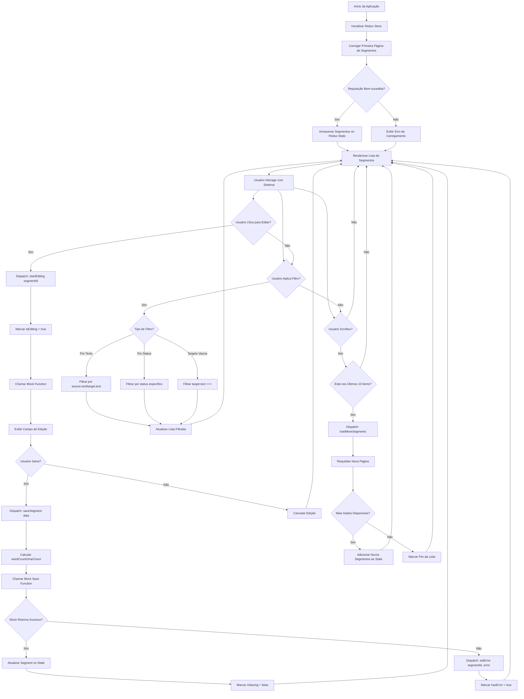

# Fluxograma - Sistema de Contexto de Segmentos

```mermaid
flowchart TD
    A[Início da Aplicação] --> B[Inicializar Redux Store]
    B --> C[Carregar Primeira Página de Segmentos]
    C --> D{Requisição Bem-sucedida?}
    
    D -->|Sim| E[Armazenar Segmentos no Redux State]
    D -->|Não| F[Exibir Erro de Carregamento]
    
    E --> G[Renderizar Lista de Segmentos]
    F --> G
    
    G --> H[Usuário Interage com Sistema]
    
    %% Fluxo de Edição
    H --> I{Usuário Clica para Editar?}
    I -->|Sim| J[Dispatch: startEditing segmentId]
    J --> K[Marcar isEditing = true]
    K --> L[Chamar Mock Function]
    L --> M[Exibir Campo de Edição]
    M --> N{Usuário Salva?}
    
    N -->|Sim| O[Dispatch: saveSegment data]
    N -->|Não| P[Cancelar Edição]
    
    O --> Q[Calcular wordCount/charCount]
    Q --> R[Chamar Mock Save Function]
    R --> S{Mock Retorna Sucesso?}
    
    S -->|Sim| T[Atualizar Segment no State]
    S -->|Não| U[Dispatch: setError segmentId, error]
    
    T --> V[Marcar isSaving = false]
    U --> W[Marcar hasError = true]
    
    V --> G
    W --> G
    P --> G
    
    %% Fluxo de Filtros
    H --> X{Usuário Aplica Filtro?}
    X -->|Sim| Y{Tipo de Filtro?}
    
    Y -->|Por Texto| Z[Filtrar por source.text/target.text]
    Y -->|Por Status| AA[Filtrar por status específico]
    Y -->|Targets Vazios| BB[Filtrar target.text === ""]
    
    Z --> CC[Atualizar Lista Filtrada]
    AA --> CC
    BB --> CC
    CC --> G
    
    %% Fluxo de Scroll Infinito
    H --> DD{Usuário Scrollou?}
    DD -->|Sim| EE{Está nos Últimos 10 Items?}
    EE -->|Sim| FF[Dispatch: loadMoreSegments]
    FF --> GG[Requisitar Nova Página]
    GG --> HH{Mais Dados Disponíveis?}
    
    HH -->|Sim| II[Adicionar Novos Segmentos ao State]
    HH -->|Não| JJ[Marcar Fim da Lista]
    
    II --> G
    JJ --> G
    EE -->|Não| G
    DD -->|Não| G
    
    I -->|Não| X
    X -->|Não| DD
```
