# Mapa Arquitetural do Frontend - Plataforma de Tradução

## Contexto da Aplicação
**Frontend React.ts para Plataforma Concorrente da Smartcat**
- Interface moderna para sistema de tradução profissional
- Gerenciamento de state com Redux Toolkit
- TypeScript para type safety
- Sistema de SmartCoins integrado

## Estrutura Geral do Projeto

```
frontend/
├── public/
│   ├── index.html
│   ├── favicon.ico
│   └── assets/                 # Assets estáticos
├── src/
│   ├── components/            # Componentes reutilizáveis
│   │   ├── common/           # Componentes genéricos
│   │   │   ├── Button/
│   │   │   ├── Modal/
│   │   │   ├── LoadingSpinner/
│   │   │   ├── Toast/
│   │   │   └── DataTable/
│   │   ├── forms/            # Componentes de formulário
│   │   │   ├── Input/
│   │   │   ├── Select/
│   │   │   ├── FileUpload/
│   │   │   └── FormValidation/
│   │   ├── layout/           # Layout components
│   │   │   ├── Header/
│   │   │   ├── Sidebar/
│   │   │   ├── Navigation/
│   │   │   └── Footer/
│   │   └── ui/               # UI específicos
│   │       ├── UserAvatar/
│   │       ├── ProjectCard/
│   │       ├── SegmentEditor/
│   │       ├── CoinBalance/  # 💰 Balance display
│   │       └── PaymentModal/ # 💳 Payment interface
│   ├── pages/                # Páginas principais
│   │   ├── auth/
│   │   │   ├── Login/
│   │   │   ├── Register/
│   │   │   └── ForgotPassword/
│   │   ├── dashboard/
│   │   │   └── Dashboard.tsx
│   │   ├── workspace/
│   │   │   ├── WorkspaceList/
│   │   │   ├── WorkspaceDetail/
│   │   │   └── CreateWorkspace/
│   │   ├── projects/
│   │   │   ├── ProjectList/
│   │   │   ├── ProjectDetail/
│   │   │   ├── CreateProject/
│   │   │   └── ProjectEditor/
│   │   ├── files/
│   │   │   ├── FileManager/
│   │   │   ├── FileUpload/
│   │   │   └── FilePreview/
│   │   ├── translation/
│   │   │   ├── TranslationEditor/
│   │   │   ├── SegmentView/
│   │   │   └── ReviewMode/
│   │   ├── coins/            # 💰 Sistema de coins
│   │   │   ├── CoinDashboard/
│   │   │   ├── PurchaseCoins/
│   │   │   ├── TransactionHistory/
│   │   │   └── PaymentSuccess/
│   │   ├── profile/
│   │   │   ├── UserProfile/
│   │   │   └── Settings/
│   │   └── admin/
│   │       ├── UserManagement/
│   │       ├── SystemSettings/
│   │       └── FinancialReports/ # 💰 Admin financial
│   ├── hooks/                # Custom React Hooks
│   │   ├── auth/             # Authentication hooks
│   │   │   ├── useAuth.ts
│   │   │   ├── useLogin.ts
│   │   │   ├── useRegister.ts
│   │   │   └── usePermissions.ts
│   │   ├── api/              # API interaction hooks
│   │   │   ├── useApiCall.ts
│   │   │   ├── useQuery.ts
│   │   │   ├── useMutation.ts
│   │   │   └── useWebSocket.ts
│   │   ├── workspace/        # Workspace hooks
│   │   │   ├── useWorkspace.ts
│   │   │   ├── useWorkspaceList.ts
│   │   │   ├── useCreateWorkspace.ts
│   │   │   └── useWorkspaceMembers.ts
│   │   ├── projects/         # Project hooks
│   │   │   ├── useProject.ts
│   │   │   ├── useProjectList.ts
│   │   │   ├── useCreateProject.ts
│   │   │   ├── useProjectFiles.ts
│   │   │   └── useProjectStats.ts
│   │   ├── files/            # File management hooks
│   │   │   ├── useFileUpload.ts
│   │   │   ├── useFileList.ts
│   │   │   ├── useFilePreview.ts
│   │   │   └── useFileProcessing.ts
│   │   ├── segments/         # Translation segment hooks
│   │   │   ├── useSegments.ts
│   │   │   ├── useSegmentEditor.ts
│   │   │   ├── useTranslation.ts
│   │   │   ├── useAutoSave.ts
│   │   │   └── useSegmentHistory.ts
│   │   ├── coins/            # 💰 SmartCoins hooks
│   │   │   ├── useCoinBalance.ts     # Saldo de coins
│   │   │   ├── usePurchaseCoins.ts   # Compra de coins
│   │   │   ├── useTransactionHistory.ts # Histórico
│   │   │   ├── usePayment.ts         # Processamento pagamento
│   │   │   ├── useCoinValidation.ts  # Validação saldo
│   │   │   └── useServiceCost.ts     # Cálculo custos
│   │   ├── ui/               # UI/UX hooks
│   │   │   ├── useModal.ts
│   │   │   ├── useToast.ts
│   │   │   ├── useTheme.ts
│   │   │   ├── useLocalStorage.ts
│   │   │   ├── useDebounce.ts
│   │   │   ├── usePagination.ts
│   │   │   └── useInfiniteScroll.ts
│   │   └── utils/            # Utility hooks
│   │       ├── useAsync.ts
│   │       ├── useInterval.ts
│   │       ├── useClickOutside.ts
│   │       ├── useKeyboardShortcuts.ts
│   │       └── useWindowSize.ts
│   ├── store/                # Redux Toolkit Store
│   │   ├── index.ts          # Store configuration
│   │   ├── rootReducer.ts    # Root reducer
│   │   ├── middleware.ts     # Custom middleware
│   │   └── slices/           # Feature slices
│   │       ├── authSlice.ts         # Authentication state
│   │       ├── userSlice.ts         # User profile state
│   │       ├── workspaceSlice.ts    # Workspace management
│   │       ├── projectSlice.ts      # Project management
│   │       ├── fileSlice.ts         # File management
│   │       ├── segmentSlice.ts      # Translation segments
│   │       ├── coinSlice.ts         # 💰 Coin balance & transactions
│   │       ├── paymentSlice.ts      # 💳 Payment processing
│   │       ├── uiSlice.ts           # UI state (modals, toast, etc)
│   │       └── settingsSlice.ts     # App settings
│   ├── services/             # API Services
│   │   ├── api.ts           # Base API configuration
│   │   ├── authService.ts   # Auth API calls
│   │   ├── userService.ts   # User API calls
│   │   ├── workspaceService.ts # Workspace API
│   │   ├── projectService.ts   # Project API
│   │   ├── fileService.ts      # File API
│   │   ├── segmentService.ts   # Segment API
│   │   ├── coinService.ts      # 💰 Coin API
│   │   ├── paymentService.ts   # 💳 Payment API
│   │   └── websocket.ts        # WebSocket connection
│   ├── types/                # TypeScript definitions
│   │   ├── auth.types.ts
│   │   ├── user.types.ts
│   │   ├── workspace.types.ts
│   │   ├── project.types.ts
│   │   ├── file.types.ts
│   │   ├── segment.types.ts
│   │   ├── coin.types.ts      # 💰 Coin types
│   │   ├── payment.types.ts   # 💳 Payment types
│   │   ├── api.types.ts
│   │   └── common.types.ts
│   ├── utils/                # Utility functions
│   │   ├── constants.ts      # App constants
│   │   ├── helpers.ts        # Helper functions
│   │   ├── formatters.ts     # Data formatters
│   │   ├── validators.ts     # Validation functions
│   │   ├── storage.ts        # LocalStorage helpers
│   │   ├── coinCalculator.ts # 💰 Coin calculations
│   │   └── dateUtils.ts      # Date utilities
│   ├── styles/               # Global styles
│   │   ├── globals.css
│   │   ├── variables.css
│   │   ├── components.css
│   │   └── themes/
│   │       ├── light.css
│   │       └── dark.css
│   ├── assets/               # Assets locais
│   │   ├── images/
│   │   ├── icons/
│   │   └── fonts/
│   ├── App.tsx               # Componente principal
│   ├── index.tsx             # Entry point
│   └── router.tsx            # Configuração de rotas
├── package.json
├── tsconfig.json
├── tailwind.config.js        # Tailwind CSS config
└── vite.config.ts            # Vite configuration
```

## 🎣 Sistema de Hooks - Arquitetura Detalhada

### **🔐 Authentication Hooks (Principais)**

#### **useAuth.ts** - Hook Principal de Autenticação
```typescript
interface UseAuthReturn {
  user: User | null;
  isAuthenticated: boolean;
  isLoading: boolean;
  login: (credentials: LoginCredentials) => Promise<void>;
  logout: () => void;
  register: (userData: RegisterData) => Promise<void>;
  updateProfile: (data: ProfileUpdateData) => Promise<void>;
}

export const useAuth = (): UseAuthReturn => {
  // Integração com authSlice do Redux
  // Gerenciamento de token JWT
  // Auto-refresh de token
  // Persistência de sessão
}
```

#### **useLogin.ts** - Hook Específico para Login
```typescript
interface UseLoginReturn {
  login: (credentials: LoginCredentials) => Promise<void>;
  isLoading: boolean;
  error: string | null;
  clearError: () => void;
}

export const useLogin = (): UseLoginReturn => {
  // Validação de formulário
  // Controle de loading state
  // Tratamento de erros específicos
  // Redirecionamento pós-login
}
```

#### **usePermissions.ts** - Hook de Controle de Acesso
```typescript
interface UsePermissionsReturn {
  hasPermission: (permission: string) => boolean;
  hasRole: (role: string) => boolean;
  canAccessFeature: (feature: string) => boolean;
  canAffordService: (service: string) => boolean; // 💰 Coin validation
}
```

### **💰 SmartCoins Hooks (Sistema Financeiro)**

#### **useCoinBalance.ts** - Hook Principal de Saldo
```typescript
interface UseCoinBalanceReturn {
  balance: number;
  isLoading: boolean;
  error: string | null;
  refreshBalance: () => Promise<void>;
  formatBalance: (amount: number) => string;
  hasEnoughCoins: (required: number) => boolean;
}

export const useCoinBalance = (): UseCoinBalanceReturn => {
  // Sincronização com coinSlice
  // Auto-refresh periódico
  // WebSocket para updates em tempo real
  // Cache inteligente
}
```

#### **usePurchaseCoins.ts** - Hook de Compra de Coins
```typescript
interface UsePurchaseCoinsReturn {
  purchaseCoins: (packageId: string) => Promise<void>;
  isProcessing: boolean;
  availablePackages: CoinPackage[];
  selectedPackage: CoinPackage | null;
  setSelectedPackage: (pkg: CoinPackage) => void;
  calculateDiscount: (pkg: CoinPackage) => number;
}

export const usePurchaseCoins = (): UsePurchaseCoinsReturn => {
  // Integração com gateway de pagamento
  // Cálculo de descontos
  // Validação de dados de pagamento
  // Handling de success/error states
}
```

#### **usePayment.ts** - Hook de Processamento de Pagamento
```typescript
interface UsePaymentReturn {
  createPaymentIntent: (amount: number) => Promise<string>;
  confirmPayment: (intentId: string) => Promise<void>;
  paymentStatus: PaymentStatus;
  isProcessing: boolean;
  error: PaymentError | null;
  retryPayment: () => Promise<void>;
}
```

#### **useCoinValidation.ts** - Hook de Validação de Saldo
```typescript
interface UseCoinValidationReturn {
  validateService: (serviceType: string, params?: any) => Promise<boolean>;
  getServiceCost: (serviceType: string, params?: any) => number;
  showInsufficientFundsModal: () => void;
  canAfford: (cost: number) => boolean;
}
```

#### **useTransactionHistory.ts** - Hook de Histórico
```typescript
interface UseTransactionHistoryReturn {
  transactions: Transaction[];
  isLoading: boolean;
  loadMore: () => Promise<void>;
  filter: TransactionFilter;
  setFilter: (filter: TransactionFilter) => void;
  exportHistory: (format: 'csv' | 'pdf') => Promise<void>;
}
```

### **📁 Project Management Hooks (Principais)**

#### **useProject.ts** - Hook Principal de Projetos
```typescript
interface UseProjectReturn {
  project: Project | null;
  isLoading: boolean;
  updateProject: (data: Partial<Project>) => Promise<void>;
  deleteProject: (id: string) => Promise<void>;
  duplicateProject: (id: string) => Promise<Project>;
  getProjectStats: () => ProjectStats;
  canModifyProject: boolean; // Permission check
}
```

#### **useProjectList.ts** - Hook de Lista de Projetos
```typescript
interface UseProjectListReturn {
  projects: Project[];
  isLoading: boolean;
  pagination: PaginationState;
  filters: ProjectFilters;
  setFilters: (filters: ProjectFilters) => void;
  loadProjects: () => Promise<void>;
  createProject: (data: CreateProjectData) => Promise<Project>;
}
```

### **📝 Translation Hooks (Core da Aplicação)**

#### **useSegmentEditor.ts** - Hook do Editor de Segmentos
```typescript
interface UseSegmentEditorReturn {
  currentSegment: Segment | null;
  translation: string;
  setTranslation: (text: string) => void;
  saveSegment: () => Promise<void>;
  nextSegment: () => void;
  previousSegment: () => void;
  autoTranslate: () => Promise<void>; // 💰 Costs coins
  isAutoSaving: boolean;
  hasUnsavedChanges: boolean;
}
```

#### **useTranslation.ts** - Hook de Serviços de Tradução
```typescript
interface UseTranslationReturn {
  translateText: (text: string, targetLang: string) => Promise<string>;
  getQualityScore: (translation: string) => Promise<number>;
  suggestAlternatives: (segment: Segment) => Promise<string[]>;
  isTranslating: boolean;
  costEstimate: number; // 💰 Coin cost for operation
}
```

#### **useAutoSave.ts** - Hook de Auto-salvamento
```typescript
interface UseAutoSaveReturn {
  enableAutoSave: boolean;
  setEnableAutoSave: (enabled: boolean) => void;
  lastSaved: Date | null;
  isSaving: boolean;
  saveNow: () => Promise<void>;
}
```

### **📁 File Management Hooks**

#### **useFileUpload.ts** - Hook de Upload de Arquivos
```typescript
interface UseFileUploadReturn {
  uploadFiles: (files: FileList) => Promise<UploadedFile[]>;
  isUploading: boolean;
  progress: number;
  uploadedFiles: UploadedFile[];
  removeFile: (id: string) => void;
  retryUpload: (id: string) => Promise<void>;
}
```

#### **useFileProcessing.ts** - Hook de Processamento
```typescript
interface UseFileProcessingReturn {
  processFile: (fileId: string) => Promise<ProcessedFile>;
  extractSegments: (fileId: string) => Promise<Segment[]>;
  isProcessing: boolean;
  processingProgress: number;
  estimatedCost: number; // 💰 Processing cost
}
```

### **🎨 UI/UX Hooks (Secundários)**

#### **useModal.ts** - Hook de Modais
```typescript
interface UseModalReturn {
  isOpen: boolean;
  openModal: (modalId?: string) => void;
  closeModal: () => void;
  modalProps: any;
  setModalProps: (props: any) => void;
}
```

#### **useToast.ts** - Hook de Notificações
```typescript
interface UseToastReturn {
  showToast: (message: string, type: ToastType) => void;
  showSuccess: (message: string) => void;
  showError: (message: string) => void;
  showWarning: (message: string) => void;
  showCoinAlert: (message: string) => void; // 💰 Coin-specific
  hideToast: (id: string) => void;
}
```

#### **useDebounce.ts** - Hook de Debounce
```typescript
export const useDebounce = <T>(value: T, delay: number): T => {
  // Para otimização de calls de API
  // Especialmente útil no editor de tradução
}
```

### **🌐 API Hooks (Integração com Backend)**

#### **useApiCall.ts** - Hook Base para API
```typescript
interface UseApiCallReturn<T> {
  data: T | null;
  isLoading: boolean;
  error: ApiError | null;
  refetch: () => Promise<void>;
}

export const useApiCall = <T>(
  endpoint: string, 
  options?: ApiOptions
): UseApiCallReturn<T> => {
  // Base hook para todas as chamadas API
  // Tratamento de errors padronizado
  // Loading states
  // Cache management
}
```

#### **useMutation.ts** - Hook para Operações de Escrita
```typescript
interface UseMutationReturn<TData, TVariables> {
  mutate: (variables: TVariables) => Promise<TData>;
  isLoading: boolean;
  error: ApiError | null;
  data: TData | null;
  reset: () => void;
}

export const useMutation = <TData, TVariables>(
  mutationFn: (variables: TVariables) => Promise<TData>
): UseMutationReturn<TData, TVariables> => {
  // Para operações POST, PUT, DELETE
  // Otimistic updates
  // Error rollback
}
```

#### **useWebSocket.ts** - Hook para WebSocket
```typescript
interface UseWebSocketReturn {
  isConnected: boolean;
  sendMessage: (message: any) => void;
  lastMessage: any;
  connectionStatus: WebSocketStatus;
  reconnect: () => void;
}

export const useWebSocket = (url: string): UseWebSocketReturn => {
  // Real-time updates para colaboração
  // Auto-reconnection
  // Message queuing
}
```

## 🏪 Redux Toolkit Store Architecture

### **Store Configuration**
```typescript
// store/index.ts
export const store = configureStore({
  reducer: rootReducer,
  middleware: (getDefaultMiddleware) =>
    getDefaultMiddleware({
      serializableCheck: {
        ignoredActions: [FLUSH, REHYDRATE, PAUSE, PERSIST, PURGE, REGISTER],
      },
    }).concat(
      authMiddleware,      // JWT handling
      coinMiddleware,      // 💰 Coin validation
      websocketMiddleware, // Real-time updates
      loggerMiddleware     // Development logging
    ),
});
```

### **🔐 Auth Slice**
```typescript
// store/slices/authSlice.ts
interface AuthState {
  user: User | null;
  token: string | null;
  refreshToken: string | null;
  isAuthenticated: boolean;
  isLoading: boolean;
  permissions: string[];
  sessionExpiry: number | null;
}

export const authSlice = createSlice({
  name: 'auth',
  initialState,
  reducers: {
    loginStart: (state) => { state.isLoading = true; },
    loginSuccess: (state, action) => { /* ... */ },
    loginFailure: (state, action) => { /* ... */ },
    logout: (state) => { /* Clear all auth data */ },
    updateProfile: (state, action) => { /* ... */ },
    refreshTokenSuccess: (state, action) => { /* ... */ },
  },
});
```

### **💰 Coin Slice**
```typescript
// store/slices/coinSlice.ts
interface CoinState {
  balance: number;
  transactions: Transaction[];
  purchaseHistory: Purchase[];
  availablePackages: CoinPackage[];
  isLoading: boolean;
  lastUpdate: string;
  pendingTransactions: string[];
}

export const coinSlice = createSlice({
  name: 'coins',
  initialState,
  reducers: {
    updateBalance: (state, action) => { /* ... */ },
    addTransaction: (state, action) => { /* ... */ },
    purchaseCoinsStart: (state) => { /* ... */ },
    purchaseCoinsSuccess: (state, action) => { /* ... */ },
    consumeCoins: (state, action) => { /* ... */ },
    loadPackages: (state, action) => { /* ... */ },
  },
});
```

### **📁 Project Slice**
```typescript
// store/slices/projectSlice.ts
interface ProjectState {
  currentProject: Project | null;
  projects: Project[];
  filters: ProjectFilters;
  pagination: PaginationState;
  isLoading: boolean;
  selectedFiles: string[];
  projectStats: ProjectStats | null;
}
```

### **📝 Segment Slice**
```typescript
// store/slices/segmentSlice.ts
interface SegmentState {
  segments: Segment[];
  currentSegmentIndex: number;
  currentSegment: Segment | null;
  unsavedChanges: { [segmentId: string]: string };
  isAutoSaving: boolean;
  editorSettings: EditorSettings;
  translationMemory: TranslationMemoryEntry[];
}
```

## 🎨 Component Architecture

### **Componentes por Categoria**

#### **🏗️ Layout Components**
```typescript
// components/layout/Header/Header.tsx
interface HeaderProps {
  user: User;
  coinBalance: number; // 💰 Display coin balance
  onLogout: () => void;
}

// components/layout/Sidebar/Sidebar.tsx  
interface SidebarProps {
  currentPage: string;
  permissions: string[];
  isCollapsed: boolean;
}
```

#### **💰 Coin Components**
```typescript
// components/ui/CoinBalance/CoinBalance.tsx
interface CoinBalanceProps {
  balance: number;
  showPurchaseButton?: boolean;
  size?: 'small' | 'medium' | 'large';
}

// components/ui/PaymentModal/PaymentModal.tsx
interface PaymentModalProps {
  isOpen: boolean;
  selectedPackage: CoinPackage;
  onClose: () => void;
  onSuccess: (transaction: Transaction) => void;
}
```

#### **📝 Translation Components**
```typescript
// components/ui/SegmentEditor/SegmentEditor.tsx
interface SegmentEditorProps {
  segment: Segment;
  onTranslationChange: (translation: string) => void;
  onSave: () => void;
  canAffordAutoTranslation: boolean; // 💰 Coin check
}
```

## 🔗 Service Layer (API Integration)

### **💰 Coin Service**
```typescript
// services/coinService.ts
export class CoinService {
  static async getBalance(userId: string): Promise<CoinBalance> { /* ... */ }
  static async purchaseCoins(packageId: string, paymentData: PaymentData): Promise<Transaction> { /* ... */ }
  static async getTransactionHistory(filters?: TransactionFilters): Promise<Transaction[]> { /* ... */ }
  static async validateServiceCost(serviceType: string, params: any): Promise<number> { /* ... */ }
  static async consumeCoins(serviceType: string, amount: number, metadata: any): Promise<void> { /* ... */ }
}
```

### **🔌 WebSocket Service**
```typescript
// services/websocket.ts
export class WebSocketService {
  static connect(userId: string): void { /* ... */ }
  static onCoinBalanceUpdate(callback: (balance: number) => void): void { /* ... */ }
  static onSegmentUpdate(callback: (segment: Segment) => void): void { /* ... */ }
  static onTransactionComplete(callback: (transaction: Transaction) => void): void { /* ... */ }
}
```

## 📱 Pages Architecture

### **💰 Coin Pages**
```typescript
// pages/coins/CoinDashboard/CoinDashboard.tsx
export const CoinDashboard: React.FC = () => {
  const { balance } = useCoinBalance();
  const { transactions } = useTransactionHistory();
  const { availablePackages } = usePurchaseCoins();
  
  return (
    <div>
      <CoinBalance balance={balance} showPurchaseButton />
      <RecentTransactions transactions={transactions.slice(0, 5)} />
      <QuickPurchase packages={availablePackages} />
    </div>
  );
};

// pages/coins/PurchaseCoins/PurchaseCoins.tsx
export const PurchaseCoins: React.FC = () => {
  const { purchaseCoins, availablePackages, isProcessing } = usePurchaseCoins();
  const { createPaymentIntent, confirmPayment } = usePayment();
  
  // Fluxo completo de compra
};
```

## 🎯 Hook Dependencies e Fluxo de Dados

### **Principais Hooks e suas Dependências**

```mermaid
graph TD
    A[useAuth] --> B[Redux authSlice]
    A --> C[authService]
    
    D[useCoinBalance] --> E[Redux coinSlice]
    D --> F[coinService]
    D --> G[useWebSocket]
    
    H[useProject] --> I[Redux projectSlice]
    H --> J[projectService]
    H --> K[useCoinValidation]
    
    L[useSegmentEditor] --> M[Redux segmentSlice]
    L --> N[segmentService]
    L --> O[useAutoSave]
    L --> P[useCoinValidation]
    
    Q[usePayment] --> R[paymentService]
    Q --> S[Redux paymentSlice]
    Q --> T[useCoinBalance]
```



### **Fluxo de Dados Principal**

```
User Action → Hook → Redux Action → API Service → Backend
                ↓
Component Update ← Redux State ← API Response ← Backend Response
```

### **Fluxo de Coins Específico**

```
Purchase Request → usePurchaseCoins → PaymentService → Gateway
                                            ↓
Coin Balance Update ← coinSlice ← WebSocket ← Backend Webhook
```

## 🎨 TypeScript Types Architecture

### **💰 Coin Types**
```typescript
// types/coin.types.ts
export interface CoinBalance {
  current: number;
  totalPurchased: number;
  totalConsumed: number;
  lastUpdated: string;
}

export interface CoinPackage {
  id: string;
  name: string;
  coins: number;
  price: number;
  currency: string;
  discount?: number;
  popular?: boolean;
}

export interface Transaction {
  id: string;
  type: 'purchase' | 'consumption' | 'refund';
  amount: number;
  description: string;
  status: TransactionStatus;
  createdAt: string;
  metadata?: any;
}

export interface ServiceCost {
  serviceType: string;
  baseRate: number;
  multiplier?: number;
  minimumCost: number;
}
```

### **📝 Project Types**
```typescript
// types/project.types.ts
export interface Project {
  id: string;
  name: string;
  description?: string;
  sourceLanguage: string;
  targetLanguages: string[];
  workspaceId: string;
  files: ProjectFile[];
  stats: ProjectStats;
  settings: ProjectSettings;
  createdAt: string;
  updatedAt: string;
}

export interface ProjectStats {
  totalSegments: number;
  translatedSegments: number;
  reviewedSegments: number;
  progress: number;
  coinsSpent: number; // 💰 Total coins used
  estimatedCompletion?: string;
}
```

## 🚀 Performance Optimizations

### **Hook Optimizations**

#### **Memoização em Hooks**
```typescript
// Exemplo de hook otimizado
export const useOptimizedCoinBalance = () => {
  const balance = useSelector(selectCoinBalance);
  
  return useMemo(() => ({
    balance,
    formattedBalance: formatCurrency(balance),
    hasEnoughForService: (cost: number) => balance >= cost,
  }), [balance]);
};
```

#### **Debounce em Editor**
```typescript
export const useSegmentEditor = (segmentId: string) => {
  const [translation, setTranslation] = useState('');
  const debouncedTranslation = useDebounce(translation, 1000);
  
  // Auto-save quando texto muda
  useEffect(() => {
    if (debouncedTranslation && segmentId) {
      saveTranslation(segmentId, debouncedTranslation);
    }
  }, [debouncedTranslation, segmentId]);
  
  return {
    translation,
    setTranslation,
    isAutoSaving: /* ... */,
  };
};
```

#### **React Query Integration**
```typescript
export const useProjectsWithQuery = () => {
  return useQuery({
    queryKey: ['projects'],
    queryFn: ProjectService.getProjects,
    staleTime: 5 * 60 * 1000, // 5 minutes
    cacheTime: 10 * 60 * 1000, // 10 minutes
  });
};
```

### **Redux Performance**

#### **Selector Optimization**
```typescript
// Selectors otimizados com reselect
export const selectProjectStats = createSelector(
  [selectCurrentProject],
  (project) => project?.stats
);

export const selectCoinBalanceFormatted = createSelector(
  [selectCoinBalance],
  (balance) => formatCurrency(balance)
);
```

#### **Immer Integration**
```typescript
// Redux Toolkit já usa Immer internamente
export const segmentSlice = createSlice({
  name: 'segments',
  initialState,
  reducers: {
    updateSegmentTranslation: (state, action) => {
      const { segmentId, translation } = action.payload;
      const segment = state.segments.find(s => s.id === segmentId);
      if (segment) {
        segment.translation = translation; // Immer torna isso imutável
      }
    },
  },
});
```

## 🔐 Security Considerations

### **Token Management**
```typescript
// hooks/auth/useAuth.ts
export const useAuth = () => {
  const dispatch = useAppDispatch();
  
  // Auto-refresh token antes de expirar
  useEffect(() => {
    const refreshToken = async () => {
      const token = getStoredToken();
      if (token && isTokenExpiringSoon(token)) {
        try {
          await dispatch(refreshTokenAsync()).unwrap();
        } catch (error) {
          dispatch(logout());
        }
      }
    };
    
    const interval = setInterval(refreshToken, 60000); // Check every minute
    return () => clearInterval(interval);
  }, [dispatch]);
};
```

### **Coin Validation Security**
```typescript
// hooks/coins/useCoinValidation.ts
export const useCoinValidation = () => {
  const balance = useSelector(selectCoinBalance);
  
  const validateService = useCallback(async (serviceType: string, params: any) => {
    // Client-side validation (UX)
    const estimatedCost = calculateServiceCost(serviceType, params);
    if (balance < estimatedCost) {
      return false;
    }
    
    // Server-side validation (Security)
    try {
      const actualCost = await CoinService.validateServiceCost(serviceType, params);
      return balance >= actualCost;
    } catch (error) {
      return false;
    }
  }, [balance]);
  
  return { validateService };
};
```

## 📊 Hooks Hierarchy e Complexidade

### **🏆 Hooks Principais (Alta Complexidade)**

| Hook | Responsabilidades | Dependências | Complexidade |
|------|-------------------|--------------|--------------|
| **useAuth** | Auth completa, permissions, session | authSlice, authService, localStorage | ⭐⭐⭐⭐⭐ |
| **useCoinBalance** | Saldo, validações, WebSocket | coinSlice, coinService, useWebSocket | ⭐⭐⭐⭐⭐ |
| **useSegmentEditor** | Editor tradução, auto-save, validação | segmentSlice, useAutoSave, useCoinValidation | ⭐⭐⭐⭐⭐ |
| **useProject** | CRUD projetos, stats, permissions | projectSlice, projectService, useAuth | ⭐⭐⭐⭐ |
| **usePurchaseCoins** | Compra coins, payment flow | paymentService, coinSlice, usePayment | ⭐⭐⭐⭐ |

### **🥈 Hooks Secundários (Média Complexidade)**

| Hook | Responsabilidades | Complexidade |
|------|-------------------|--------------|
| **useFileUpload** | Upload, progress, retry | ⭐⭐⭐ |
| **useTransactionHistory** | Histórico, filtros, export | ⭐⭐⭐ |
| **useWorkspace** | Workspace CRUD, members | ⭐⭐⭐ |
| **useAutoSave** | Auto-salvamento inteligente | ⭐⭐⭐ |
| **usePermissions** | Role-based access control | ⭐⭐⭐ |

### **🥉 Hooks Utilitários (Baixa Complexidade)**

| Hook | Responsabilidades | Complexidade |
|------|-------------------|--------------|
| **useModal** | Modal state management | ⭐⭐ |
| **useToast** | Notifications | ⭐⭐ |
| **useDebounce** | Performance optimization | ⭐ |
| **useLocalStorage** | Local storage abstraction | ⭐ |
| **useTheme** | Theme switching | ⭐ |

## 🎯 Hook Usage Patterns

### **Composição de Hooks**
```typescript
// Exemplo de hook composto para página de projeto
export const useProjectPage = (projectId: string) => {
  const { project, updateProject, isLoading } = useProject(projectId);
  const { balance, canAfford } = useCoinBalance();
  const { hasPermission } = usePermissions();
  const { showToast } = useToast();
  
  const canEditProject = useMemo(() => {
    return hasPermission('project.edit') && project?.ownerId === currentUserId;
  }, [hasPermission, project]);
  
  const executeTranslation = useCallback(async (segments: Segment[]) => {
    const cost = calculateTranslationCost(segments);
    
    if (!canAfford(cost)) {
      showToast('Saldo insuficiente para tradução', 'error');
      return;
    }
    
    // Execute translation logic
  }, [canAfford, showToast]);
  
  return {
    project,
    isLoading,
    canEditProject,
    executeTranslation,
    coinBalance: balance,
  };
};
```

### **Hook Pattern para Features**
```typescript
// Pattern para features que consomem coins
export const useCoinConsumingFeature = (featureType: string) => {
  const { validateService, getServiceCost } = useCoinValidation();
  const { showCoinAlert } = useToast();
  
  const executeFeature = useCallback(async (params: any) => {
    const canExecute = await validateService(featureType, params);
    
    if (!canExecute) {
      const cost = getServiceCost(featureType, params);
      showCoinAlert(`Esta operação requer ${cost} coins. Compre mais coins para continuar.`);
      return null;
    }
    
    // Execute feature logic
    return await FeatureService.execute(featureType, params);
  }, [validateService, getServiceCost, showCoinAlert, featureType]);
  
  return { executeFeature };
};
```

## 🌐 Real-time Features com WebSocket

### **useWebSocket Hook Advanced**
```typescript
export const useWebSocket = () => {
  const [socket, setSocket] = useState<WebSocket | null>(null);
  const [isConnected, setIsConnected] = useState(false);
  const { user } = useAuth();
  const dispatch = useAppDispatch();
  
  useEffect(() => {
    if (!user) return;
    
    const ws = new WebSocket(`${WS_URL}?token=${user.token}`);
    
    ws.onopen = () => {
      setIsConnected(true);
      setSocket(ws);
    };
    
    ws.onmessage = (event) => {
      const message = JSON.parse(event.data);
      
      switch (message.type) {
        case 'COIN_BALANCE_UPDATE':
          dispatch(updateBalance(message.data));
          break;
        case 'SEGMENT_UPDATE':
          dispatch(updateSegment(message.data));
          break;
        case 'PROJECT_MEMBER_JOINED':
          dispatch(addProjectMember(message.data));
          break;
        case 'TRANSACTION_COMPLETE':
          dispatch(addTransaction(message.data));
          break;
      }
    };
    
    ws.onclose = () => {
      setIsConnected(false);
      // Auto-reconnect logic
      setTimeout(() => {
        if (user) {
          setSocket(null);
        }
      }, 3000);
    };
    
    return () => {
      ws.close();
    };
  }, [user, dispatch]);
  
  const sendMessage = useCallback((message: any) => {
    if (socket && isConnected) {
      socket.send(JSON.stringify(message));
    }
  }, [socket, isConnected]);
  
  return { isConnected, sendMessage };
};
```

## 🎨 Component-Hook Integration Patterns

### **Smart vs Dumb Components**
```typescript
// Smart Component (com hooks)
export const ProjectDashboard: React.FC = () => {
  const {
    projects,
    isLoading,
    createProject,
    filters,
    setFilters
  } = useProjectList();
  
  const { balance } = useCoinBalance();
  const { showToast } = useToast();
  
  return (
    <ProjectDashboardPresentation
      projects={projects}
      isLoading={isLoading}
      coinBalance={balance}
      onCreateProject={createProject}
      filters={filters}
      onFiltersChange={setFilters}
      onShowToast={showToast}
    />
  );
};

// Dumb Component (apenas props)
interface ProjectDashboardPresentationProps {
  projects: Project[];
  isLoading: boolean;
  coinBalance: number;
  onCreateProject: (data: CreateProjectData) => void;
  filters: ProjectFilters;
  onFiltersChange: (filters: ProjectFilters) => void;
  onShowToast: (message: string, type: ToastType) => void;
}

export const ProjectDashboardPresentation: React.FC<ProjectDashboardPresentationProps> = ({
  projects,
  isLoading,
  coinBalance,
  // ... outras props
}) => {
  // Apenas renderização, sem lógica
};
```

## 🧪 Testing Strategy para Hooks

### **Hook Testing Patterns**
```typescript
// __tests__/hooks/useCoinBalance.test.ts
import { renderHook, act } from '@testing-library/react';
import { Provider } from 'react-redux';
import { useCoinBalance } from '../useCoinBalance';

describe('useCoinBalance', () => {
  it('should return current balance', () => {
    const { result } = renderHook(() => useCoinBalance(), {
      wrapper: ({ children }) => (
        <Provider store={mockStore}>{children}</Provider>
      ),
    });
    
    expect(result.current.balance).toBe(100);
  });
  
  it('should validate coin requirements', () => {
    const { result } = renderHook(() => useCoinBalance());
    
    expect(result.current.hasEnoughCoins(50)).toBe(true);
    expect(result.current.hasEnoughCoins(150)).toBe(false);
  });
});
```

### **Integration Tests**
```typescript
// __tests__/integration/coinPurchase.test.ts
describe('Coin Purchase Flow', () => {
  it('should complete purchase flow', async () => {
    const { result } = renderHook(() => usePurchaseCoins());
    
    await act(async () => {
      await result.current.purchaseCoins('package-basic');
    });
    
    expect(result.current.isProcessing).toBe(false);
    expect(mockCoinService.purchaseCoins).toHaveBeenCalled();
  });
});
```

## 🚀 Deployment e Build Optimizations

### **Code Splitting por Features**
```typescript
// Lazy loading para features de coins
const CoinDashboard = lazy(() => import('./pages/coins/CoinDashboard'));
const PurchaseCoins = lazy(() => import('./pages/coins/PurchaseCoins'));

// Router com suspense
<Route path="/coins/dashboard" element={
  <Suspense fallback={<LoadingSpinner />}>
    <CoinDashboard />
  </Suspense>
} />
```

### **Bundle Analysis**
```json
// package.json scripts
{
  "analyze": "npm run build && npx webpack-bundle-analyzer build/static/js/*.js",
  "build:profile": "npm run build -- --profile",
}
```

## 📈 Analytics e Monitoring

### **Hook Analytics**
```typescript
export const useAnalytics = () => {
  const trackEvent = useCallback((event: string, properties?: any) => {
    // Track hook usage for optimization
    analytics.track(event, properties);
  }, []);
  
  const trackCoinUsage = useCallback((serviceType: string, amount: number) => {
    trackEvent('coin_consumed', {
      serviceType,
      amount,
      timestamp: new Date().toISOString(),
    });
  }, [trackEvent]);
  
  return { trackEvent, trackCoinUsage };
};
```

## 🎯 Roadmap e Future Enhancements

### **Planned Hook Improvements**
- **useOfflineSync**: Sync data when connection restored
- **useCollaboration**: Real-time collaborative editing
- **useAI**: AI-powered translation suggestions
- **useBulkOperations**: Batch operations with coin optimization
- **useAdvancedAnalytics**: Detailed usage analytics

### **Performance Targets**
- **Initial Load**: < 3 segundos
- **Route Transitions**: < 500ms
- **Hook Execution**: < 100ms average
- **Bundle Size**: < 2MB total
- **Tree Shaking**: 90%+ effectiveness

Esta arquitetura de frontend oferece uma base sólida e escalável para uma plataforma de tradução profissional, com foco especial no sistema de SmartCoins e uma experiência de usuário fluida e responsiva.
